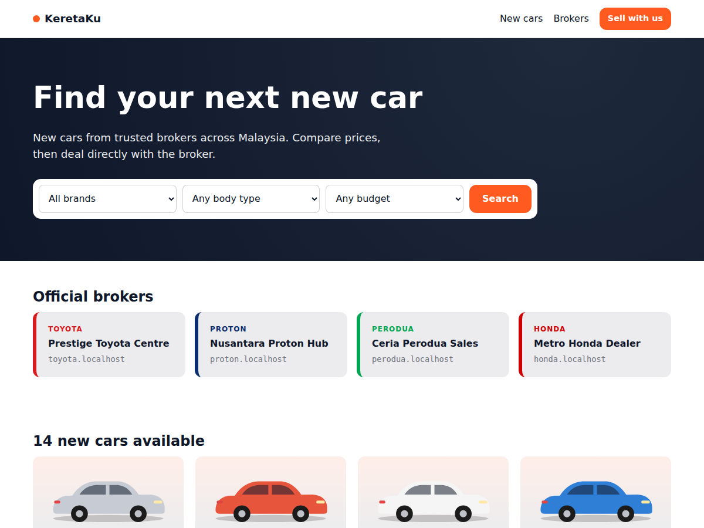
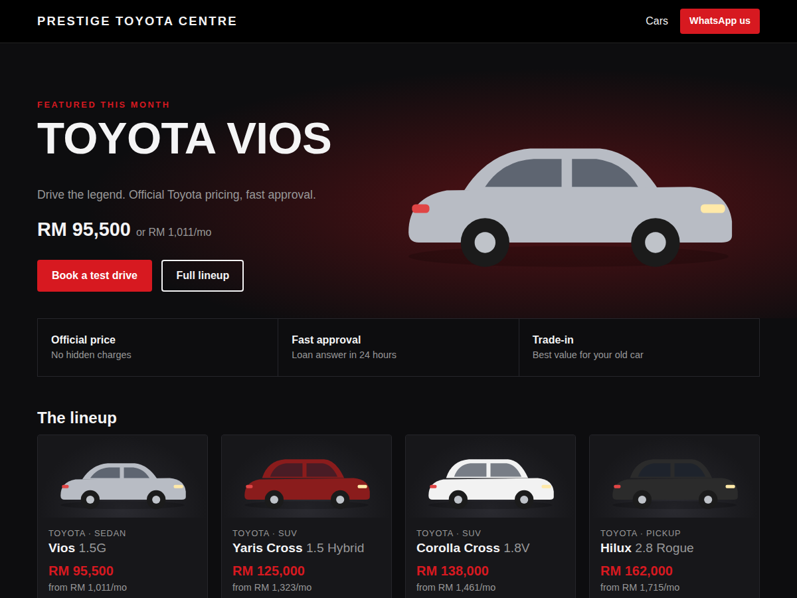
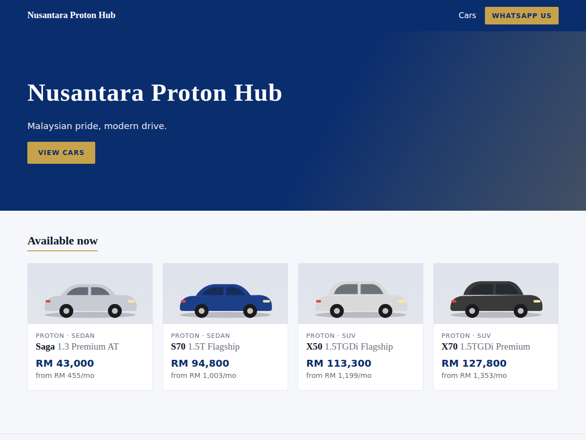
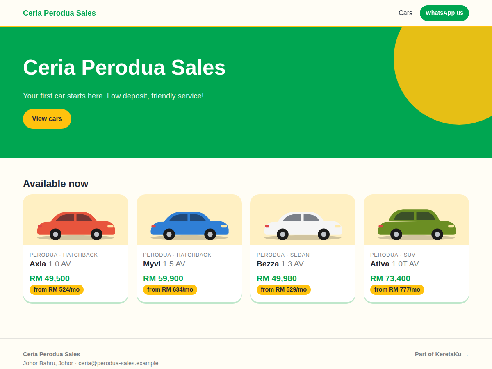

# KeretaKu: multi-broker new car marketplace (sample)

A small Carsome-style sample, in plain PHP 8 with no dependencies:

- **Main site** (`keretaku.my`) lists every broker's cars, with filters for brand, body type and budget, plus a directory of brokers.
- **Each broker gets a subdomain** (`toyota.keretaku.my`, `proton.keretaku.my`, …) that shows only their stock and sends leads to them.
- **Each broker can have their own design.** There are three levels:
  1. **Colours only.** Set the `colors` in `config/brokers.php` (Honda uses this with the default theme).
  2. **CSS theme.** Add `public/themes/<name>.css` (Proton `sleek`, Perodua `friendly`).
  3. **Custom templates.** Add `themes/<name>/home.php` (or `car.php`, `layout.php`…) to change the layout completely (Toyota `showroom`). Any template a theme doesn't provide falls back to `themes/base/`.
- A broker can also use **their own domain** by setting `custom_domain`.

| Main site | Toyota (custom templates) | Proton (CSS only) | Perodua (CSS only) |
|---|---|---|---|
|  |  |  |  |

## Run locally

```bash
cd car-marketplace
php -S localhost:8000 -t public public/index.php
```

Chrome, Edge and Firefox resolve `*.localhost` to your own machine, so you need no hosts-file changes:

- http://localhost:8000 is the main marketplace
- http://toyota.localhost:8000, http://proton.localhost:8000, http://perodua.localhost:8000 and http://honda.localhost:8000 are the broker sites

If your browser doesn't support that (Safari), use `http://localhost:8000/?broker=toyota`. This only works while `APP_DEBUG=1`.

Enquiries are saved to `storage/leads.jsonl`, tagged with the broker.

## How it works

```
Request Host header ──► resolve_site()  (src/bootstrap.php)
   keretaku.my            → main marketplace   (theme: marketplace)
   toyota.keretaku.my     → broker "toyota"    (theme from config)
   www.my-own-domain.my   → broker with that custom_domain
   unknown.keretaku.my    → 404
```

| Path | What it is |
|---|---|
| `public/index.php` | Front controller and routes |
| `src/bootstrap.php` | Tenant resolution, theme lookup, helpers |
| `config/brokers.php` | Broker registry: subdomain, name, contact, theme, colours |
| `data/cars.php` | Inventory; each car belongs to one broker |
| `themes/base/` | Default templates (every theme falls back here) |
| `themes/<theme>/` | Per-broker template overrides |
| `public/themes/<theme>.css` | Per-broker styling |

## Adding a broker

1. Add an entry to `config/brokers.php`. The array key is the subdomain.
2. Add their cars to `data/cars.php` with `'broker' => '<key>'`.
3. Pick an existing theme or make a new one.

## Deploying (production)

1. **DNS:** create a wildcard record, e.g. `*.keretaku.my  A  <server-ip>`, plus one for `keretaku.my`.
2. **SSL:** get a wildcard certificate for `*.keretaku.my` (Let's Encrypt with a DNS challenge, or Cloudflare).
3. **Web server** (nginx example):

   ```nginx
   server {
       listen 443 ssl;
       server_name keretaku.my *.keretaku.my;   # add broker custom domains here too
       root /var/www/car-marketplace/public;
       index index.php;
       location / { try_files $uri /index.php?$query_string; }
       location ~ \.php$ {
           include fastcgi_params;
           fastcgi_param SCRIPT_FILENAME $document_root/index.php;
           fastcgi_param BASE_DOMAIN keretaku.my;
           fastcgi_param APP_DEBUG 0;
           fastcgi_pass unix:/run/php/php8.3-fpm.sock;
       }
   }
   ```

## Next steps toward a real product

- Move `brokers` and `cars` into MySQL tables. The array shapes map directly to columns.
- Add a broker dashboard (login per broker) to manage stock, upload photos and see leads.
- Add a super-admin panel to onboard brokers and assign themes.
- Replace the SVG placeholders with real photos, add image galleries and compare cars.
- Send lead notifications to brokers by email or WhatsApp.
